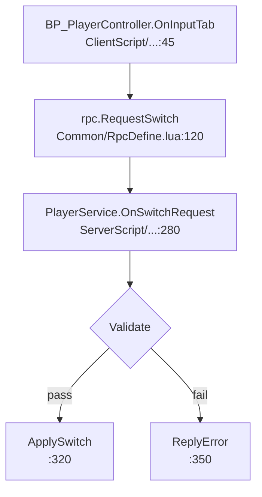

# Code Read — 模块源码深度阅读

给定一个模块名（中/英/目录名/路径），自动横跨 **UE C++**、**蓝图资产 (DevIntelligence)**、**Lua (UnLua + Server/Client/Common)** 三种载体定位相关源码，读完后产出一份结构化 md 分析文档。

## 核心定位

| Skill | 关注层 | 输出风格 |
|------|--------|---------|
| **code-read（本 skill）** | **源码细节** | 函数级粒度，调用链精确到 file:line，核心数据结构展开 |
| `module-research` | 架构 / 设计意图 | 模块在哪一层落地、跨服务怎么协作、整体实现思路 |

如果你既想要架构观又想要源码细节，**先跑 module-research 再跑 code-read**——前者给出文件清单和实现思路，后者据此精读。两个 skill 互不依赖，单跑也成立。

## 何时触发

用户说出以下任意一种意图时触发：

- "帮我看一下 X 的代码 / 这几个文件"
- "详细说明它的代码结构、调用逻辑、核心数据、模块依赖"
- "剖析 / 解剖 / 解读 / 过一遍 X"
- "X 是怎么写的"（焦点在**源码细节**，不是架构）
- 直接贴出几个文件路径要求"详细分析"

**不触发**：
- 写新代码（→ dev-pipeline）
- 改 bug（→ higame-bug-investigator）
- 仅想知道"X 在哪 / 是怎么设计的"而不需要源码细节（→ module-research）

---

## 设计原则（也是上下文管理红线）

读源码这件事**特别容易把主对话上下文撑爆**——一个 Lua 业务脚本 1k+ 行，一个蓝图 .lua 元文件 200KB，加在一起读 5-6 个就过 10 万 tokens。

所以本 skill 强制以下三条：

1. **主对话不批量 Read 源码全文**——批量阅读委托给 subagent
2. **每次最多读 30 个文件**（命中超过 30 个，把"剩余文件"列入"未覆盖范围"）
3. **C/S 分层 + 三语言全覆盖默认开启**——除非用户明确说"只看 Lua"

> 这套思路的代价：subagent 之间不共享上下文，可能重复检索同一文件。换来的是单次主对话精读一个中等模块可以控制在 40k tokens 以内，而不是 200k+。

---

## 执行流程

skill 有三种输出模式，Phase 0 根据用户措辞决定走哪条：

**标准分析模式**（默认）——产出结构化分析文档 `<module>.md`：

```
┌─ Phase 0  解析输入 + 路径确认 + 模式判定   （主对话，~1k tokens）
├─ Phase 1  三语言并行定位文件              （subagent ×3 并行：C++ / 蓝图 / Lua）
├─ Phase 2  文件清单合流 + 优先级排序        （主对话，纯文本处理）
├─ Phase 3  分批精读                        （subagent，每 batch ≤ 10 文件）
└─ Phase 4  合成 md 分析文档                （主对话，写 code-reads/<module>/<module>.md）
```

**逐函数注解模式**（用户说"详细注解"/"逐函数注解"/"贴代码注解"/"annotated"时触发）——产出带原始代码片段+逐函数注解的 `<module>-annotated.md`：

```
┌─ Phase 0  解析输入 + 路径确认 + 模式判定   （主对话，识别"注解"意图）
├─ Phase 1  定位目标文件                    （subagent 或主对话直接确认用户贴的路径）
├─ Phase A  生成阅读导览                    （主对话，先拿函数大纲，再产出四层阅读路线给 agent）
├─ Phase B  按导览逐函数注解                （subagent 按导览精读，贴代码+逐段注解，写 code-reads/<module>/<module>-annotated.md）
└─ Phase C  未覆盖范围决策表生成            （主对话，解析 Phase B 产出的未覆盖项 + grep 联动预判，写 code-reads/<module>/<module>-coverage-decisions.md）
```

**联动续注模式**（用户贴 `-coverage-decisions.md` 决策表，或对已有 `<module>-annotated.md` 说"继续深入 X、Y"时触发）——基于原注解文件，对用户勾选的未覆盖项跑注解，并把联动关系双向回填到原注解：

```
┌─ Phase 0  解析输入 + 路径确认 + 模式判定   （主对话，识别"联动续注"意图，解析勾选项）
├─ Phase D.1  联动点索引                    （主对话，grep 原注解建 LINKAGE_INDEX，不读源码）
├─ Phase D.2  联动注解 subagent             （subagent 串行，每勾选项一次，产出 code-reads/<new-module>/<new-module>-annotated.md + 联动块）
├─ Phase D.3  原注解回填                    （主对话，Edit 原 annotated.md：行内脚注 + 联动索引块 + 未覆盖范围表状态更新）
└─ Phase D.4  回复用户简报                  （主对话）
```

每个 Phase 之间主对话**只接收一份 markdown 摘要**（每份 ≤ 3k tokens）。某 Phase 失败不阻塞，写入报告时把"未完成"如实写进「未覆盖范围」。

> 联动续注模式必须基于已存在的 `<module>-annotated.md`——它是 Phase C 决策表的产物链下游。若用户未先跑注解模式，主对话提示用户先跑一次注解模式建立基线。

---

## Phase 0：解析输入 + 路径确认

### 0.1 解析模块标识

从用户输入解析以下变量：

| 变量 | 含义 | 示例 |
|------|------|------|
| `MODULE_NAME` | 用户给的模块标识 | "角色切换" / "BPA_Pika" / "SwitchPlayer" / 文件路径 |
| `KEYWORDS` | 1-4 个搜索关键词（中文 + 英文 + 可能的拼音首字母） | "角色切换", "SwitchPlayer", "ChangeCharacter" |
| `SCOPE_HINT` | 用户额外约束 | "只看 Lua" / "只看服务端" / "只看 OnActivate 流程" |

**关键词扩展**：用户给中文时主动给 2-3 个英文候选。把握不准时调用 `mcp__knot__knowledgebase_search`（HiGame 文档库 uuid `5f6c9ae808f34baeb5f7922ada2cd50b`，**必须委托给 subagent**，主对话禁止直接调用 MCP 知识库检索）。

**当用户直接贴文件路径**：跳过关键词扩展，直接进 Phase 3 精读（Phase 1/2 跳过）。

### 0.1b 识别输出模式（标准分析 / 逐函数注解 / 联动续注）

三种模式的产出和使用场景完全不同，必须在 Phase 0 明确选择：

| 维度 | 标准分析模式（默认） | 逐函数注解模式 | 联动续注模式 |
|------|----------------------|----------------|--------------|
| 触发措辞 | "分析"/"看下"/"读一下"/"code read" | "详细注解"/"逐函数注解"/"贴代码注解"/"带行号注解"/"annotated" | 贴 `-coverage-decisions.md` 路径 / "继续深入 X、Y" / "联动注解" / "补 \<原模块\> 的下游" |
| 前置条件 | 无 | 无 | **必须已存在** `code-reads/<module>/<module>-annotated.md` |
| 产出文件名 | `code-reads/<module>/<module>.md` | `code-reads/<module>/<module>-annotated.md` + `<module>-coverage-decisions.md` | `code-reads/<new-module>/<new-module>-annotated.md` × N（N = 勾选项数）+ 原注解回填 |
| 产出风格 | 结构化分析：模块全景/数据结构/调用逻辑/依赖/可疑点 | 逐函数贴原始代码片段 + 逐段注解 + 行号 + 未覆盖决策表 | 新模块逐函数注解（含联动块）+ 原注解自动回填脚注/索引 |
| 适用场景 | 想快速建立模块全局观、做技术选型、写交接文档 | 想精读源码细节、新人 onboarding、代码走读 | 已有注解，想让某个未覆盖下游/兄弟模块和原注解双向挂钩 |
| 文档体量 | 中（~500-800 行） | 大（~1000-2000 行，含代码片段）+ 决策表（~30-60 行） | 视勾选项数，每项 ~500-1500 行 |

**判定规则**（按优先级从高到低）：

1. **联动续注模式**——以下任一命中即进：
   - 用户贴的路径文件名含 `-coverage-decisions`
   - 用户贴了 `<X>-annotated.md` 路径且措辞含"继续"/"深入"/"联动"/"补"/"下游"
   - 用户说"继续深入 X、Y"且 X、Y 在已存在 annotated.md 的"未覆盖范围"表里
2. **逐函数注解模式**——用户输入含"注解"/"annotated"/"逐函数"/"贴代码"/"带行号"等词
3. **标准模式**——用户明确说"只要分析概览"/"不要贴代码"，或含糊（如"详细分析"）
4. **含糊兜底**：默认**标准模式**，但 Phase 0 回复用户时主动询问一次是否需要注解模式

**注解模式确认**：识别到注解意图后，用 AskUserQuestion 确认：
```
question: "检测到注解意图，按哪种方式产出？"
options:
  - "逐函数注解（贴代码+逐段注解，输出 <module>-annotated.md）（推荐）"
  - "标准结构化分析（输出 <module>.md）"
```

**联动续注模式确认**：识别到联动续注意图后，Phase 0 解析以下变量：

| 变量 | 含义 | 解析方式 |
|------|------|---------|
| `SOURCE_ANNOTATED` | 原注解文件路径 | 用户贴的 annotated.md 路径，或从 `-coverage-decisions.md` 文件名推断（取所在子目录名作为 module，拼 `code-reads/<module>/<module>-annotated.md`） |
| `DECISION_TABLE` | 决策表路径 | 用户贴的 `-coverage-decisions.md` 路径；若用户只贴 annotated.md 则推断 `code-reads/<module>/<module>-coverage-decisions.md`，不存在则跳过决策表读取 |
| `SELECTED_ITEMS` | 勾选要深入的未覆盖项清单 | 读 DECISION_TABLE 里所有 `- [x]` 行解析；若用户直接说"继续深入 X、Y"未贴决策表，则 X、Y 直接作为清单 |
| `SOURCE_MODULE` | 原模块名（子目录名） | 从 SOURCE_ANNOTATED 路径的倒数第二级目录取（如 `code-reads/replication-uobject-manager/replication-uobject-manager-annotated.md` → `replication-uobject-manager`） |

解析完成后用 AskUserQuestion 确认范围：
```
question: "检测到联动续注意图，确认深入范围？"
options:
  - "对勾选项 <N 个清单预览> 跑联动注解（推荐）"
  - "追加其他未覆盖项（先编辑决策表）"
  - "改回标准注解模式（重新跑一次独立注解）"
```

识别为联动续注模式后，跳过 Phase 1/2/3/4/A/B/C，走 Phase D（见下方「Phase D：跨模块联动注解」章节）。

识别为注解模式后，跳过 Phase 2/3/4，走 Phase A → Phase B → Phase C（见下方相关章节）。

### 0.2 确认输出路径

输出位置固定在 **当前 workspace 根目录下的 `code-reads/<module-slug>/` 子目录**——每个模块一个独立子目录，该模块的所有产出（标准分析 / 注解 / 决策表 / 联动续注的导览）都放在同一子目录下，便于整模块归档与迁移。

```
code-reads/<module-slug>/<module-slug>.md                      ← 标准分析模式
code-reads/<module-slug>/<module-slug>-annotated.md           ← 逐函数注解模式
code-reads/<module-slug>/<module-slug>-coverage-decisions.md  ← 注解模式的决策表
code-reads/<module-slug>/reading-guide.md                    ← 注解模式的 Phase A 导览（可选留档）
```

`<module-slug>` = MODULE_NAME 的 ASCII 化短串（"角色切换" → `character-switch`，"BPA_Pika" 保持原样，"UORManagerComponent" → `uormanager-component`）。

> **为什么每个模块单独一个子目录**：注解模式 + 联动续注模式会为同一个模块产出多份相互引用的文档（注解主体 + 决策表 + 导览，联动续注还会新增下游模块的子目录）。若全部扁平放在 `code-reads/` 下，随着模块数量增长会迅速膨胀成几百个文件的平铺列表，且同一模块的关联文档难以一眼识别。按模块名分子目录后，`ls code-reads/` 直接看到模块清单，`ls code-reads/<module>/` 看到该模块的全部产出。
>
> **与 PM 流水线目录的边界**：code-read 产出是面向人阅读的模块分析文档，与 `progress/<workspace>/` 运行时产物（state.json / progress.md 等过程追踪文件）职责不同。混在 progress 下会让流水线目录被只读分析文档污染，也偏离 progress 目录"AI 过程状态"的语义。

**询问用户确认**：

```
AskUserQuestion:
  question: "代码分析文档写到哪里？"
  options:
    - "code-reads/<module-slug>/<module-slug>.md（推荐，模块子目录下）"
    - "当前对话目录下的 <module-slug>-code-read.md（临时）"
    - "用户指定路径"
```

> 「当前 workspace 根目录」= 启动 skill 时的工作目录（通常是 `workspaces/<workspace-name>/`），不是其下的 `progress/` 子目录。

### 0.3 工具链探活

```bash
# Everything 探活
es.exe -get-everything-version 2>/dev/null && echo "EVERYTHING_AVAILABLE" || echo "EVERYTHING_NOT_AVAILABLE"
```

记录 `EVERYTHING_AVAILABLE`，影响 Phase 1 蓝图资产检索路径。

---

## Phase 1：三语言并行定位文件（3 个 subagent 并发）

**并发**调用 3 个 Explore subagent，每个负责一种载体，回传精炼的"候选文件清单"。

> 用 `Agent` tool 在**一条 message 内并行**触发 3 次调用，节省墙钟时间。

### Phase 1A：UE C++ 文件检索（subagent A）

PROMPT 模板：

```
你是 HiGame 项目 C++ 文件检索 subagent。
任务：找出 <MODULE_NAME> 相关的 UE C++ 源码文件，回传候选清单。

输入：
- 模块名: <MODULE_NAME>
- 关键词: <KEYWORDS>
- 范围提示: <SCOPE_HINT>

路径：
- CODELINK = <codelink_target_dir>，搜代码用这里（27 万文件，含 symlink）
- UE_PROJECT 真实代码: CODELINK/Projects/HiGame/Source/
- UE 引擎: CODELINK/Engine/Source/（默认不搜，除非用户特别要求）

检索方式（用 Bash 的 rg）：
1. 对每个英文关键词:
   rg --follow -t cpp -g '!*Test*' '<keyword>' CODELINK/Projects/HiGame/Source/ --files-with-matches | head -30
2. 收集命中文件路径，按出现次数和文件名相关度排序
3. 对前 5 个文件，用 rg -n 定位类/函数定义所在行号（不要 Read 全文）

产出格式（直接 stdout，纯 markdown）：

# Phase 1A — C++ 文件候选

## 命中文件（按相关度排序）
| 文件路径（相对 CODELINK） | 类/函数关键命中行 | 推测角色 |
|---|---|---|
| Projects/HiGame/Source/X/Y.cpp | class FooComponent: line 42 | 推测：核心组件 |
| ...（最多 15 行）|

## 未命中说明（如适用）
- 关键词 <X> 在 C++ 中无命中（推测：本模块无 C++ 实现 / 关键词需要扩展）

约束：
- 严禁 Read 任何 C++ 文件全文，只用 rg
- 命中 > 15 个时截断到 15，剩余只列计数
- 命中 0 个时直接写"无命中"，不要伪造
```

### Phase 1B：蓝图资产检索（subagent B）

PROMPT 模板（**核心**：搜 DevIntelligence 反射导出的 .lua 元信息，而不是真正的 .uasset 二进制）：

```
你是 HiGame 项目蓝图资产检索 subagent。
任务：找出 <MODULE_NAME> 相关的蓝图，定位其 DevIntelligence 元文件 + UnLua 绑定。

输入：
- 模块名: <MODULE_NAME>
- 关键词: <KEYWORDS>
- Everything 可用: <EVERYTHING_AVAILABLE>

路径：
- DevIntelligence（反射元信息）: CODELINK/DevIntelligence/LuaTypeDefinitions/Game/
- UE_PROJECT 资产实际目录: <ue_workspace_root>/UnrealEngine/Projects/HiGame/Content/

检索方式：

Step 1 — DevIntelligence 元信息按内容检索：
  对每个英文关键词:
    rg --follow '<keyword>' -g '*.lua' CODELINK/DevIntelligence/LuaTypeDefinitions/Game/ --files-with-matches | head -20

Step 2 — 蓝图资产文件按文件名检索（仅 EVERYTHING_AVAILABLE=true）：
    es.exe -path "<UE_PROJECT_REAL_PATH>/Content" "<keyword> .uasset" 2>/dev/null | head -20
  不可用 fallback:
    rg --files --follow -g '*<keyword>*.uasset' CODELINK/Projects/HiGame/Content/ | head -20

Step 3 — UnLua 绑定提取：
  对 Step 1 命中的每个 .lua 元文件，Read 头部 30 行（仅头部！），提取：
    - "--- Lua binding (server):" 行
    - "--- Lua binding (client):" 行
    - "--- Lua binding inherited from:" 行
    - "--- Inherits:" 行

产出格式：

# Phase 1B — 蓝图候选

## 命中蓝图（按相关度排序）
| 蓝图名 | DevIntelligence 元文件 | UnLua 绑定（server / client） | 继承链 |
|---|---|---|---|
| BPA_Pika | Game/Character/.../BPA_Pika.lua | server: ServerScript.actors.BP_Pika_C | A > B |
| ...（最多 15 行）|

## 关键发现
- <发现 1：含 file:line>
- ...

## 未命中说明（如适用）
- Everything 不可用，仅扫了 DevIntelligence

约束：
- 严禁 Read .lua 元文件超过头 30 行
- 命中 > 15 截断，剩余列计数
- 不输出"代码质量良好"等评价
```

### Phase 1C：Lua 业务脚本检索（subagent C）

PROMPT 模板：

```
你是 HiGame 项目 Lua 业务脚本检索 subagent。
任务：找出 <MODULE_NAME> 相关的 Lua 业务脚本（ServerScript / ClientScript / CommonScript）。

输入：
- 模块名: <MODULE_NAME>
- 关键词: <KEYWORDS>

路径：
- 主脚本根: CODELINK/Projects/HiGame/Content/Script/
- CP 模块根: CODELINK/Projects/HiGame/Content/CP*/Script/
- 子目录：ServerScript / ClientScript / CommonScript

检索方式：

Step 1 — 按文件名命中：
  rg --files --follow -g '*<keyword>*.lua' CODELINK/Projects/HiGame/Content/Script/ | head -20
  对 CP 模块同样跑一遍

Step 2 — 按内容命中（函数名、类名）：
  对每个关键词:
    rg --follow -t lua -g '!**/Common/Utils/**' '<keyword>' CODELINK/Projects/HiGame/Content/Script/ --files-with-matches | head -20

Step 3 — 角色识别（不读全文）：
  根据路径前缀直接判断：
    - ServerScript/* → server
    - ClientScript/* → client
    - CommonScript/* → common
  对每个文件用 rg -n 命中关键词所在行号（仅 1-2 行）

产出格式：

# Phase 1C — Lua 脚本候选

## 命中文件（按相关度排序，分 server/client/common）
| 文件路径 | 角色 | 命中关键词行号 | 文件总行数 |
|---|---|---|---|
| Content/Script/ServerScript/.../X.lua | server | rg 命中行号 | wc -l 行数 |
| ...（最多 15 行）|

文件总行数提示：> 800 行的文件后续 Phase 3 要分段读。

## 未命中说明（如适用）

约束：
- 严禁 Read 任何 .lua 业务脚本（只用 rg）
- 命中 > 15 截断
- 文件总行数用 `wc -l` 获取，不省略
```

---

## Phase 2：清单合流 + 优先级排序（主对话）

主对话收到 3 份摘要后，做以下合流（**纯文本处理，不 Read 任何文件**）：

1. **去重**：同一文件不同来源命中合并
2. **优先级打分**（高/中/低）：
   - **高**：文件名直接命中模块名、含明确入口函数（Initialize / OnActivate / Bind* / 主入口蓝图）
   - **中**：含关键词但非入口、是被依赖的工具类
   - **低**：弱命中、可能是同名巧合
3. **截断到 30 个文件总量上限**——超出列入"未覆盖文件"
4. **分批**：把待精读文件分成 ≤ 10 个/批，决定 Phase 3 需要几轮 subagent

**输出主对话内部状态**（不打印给用户）：

```
PHASE_3_BATCHES = [
  Batch 1 (高优先级，core): [file1, file2, ..., file10]
  Batch 2 (中优先级，supporting): [file11, ..., file20]
  Batch 3 (低优先级，可选): [file21, ..., file30]
]
DEFERRED = [file31, ..., fileN]  # 进"未覆盖范围"
```

---

## Phase 3：分批精读（subagent，每 batch 一次调用）

对每个 batch，委托一个 subagent 精读，回传结构化摘要。**串行**（不并发），因为后批可能需要前批的结论辅助理解。

PROMPT 模板：

```
你是 HiGame 项目源码精读 subagent。
任务：精读以下 <N> 个文件，回传"代码结构 + 调用逻辑 + 核心数据 + 依赖"四维摘要。

模块名: <MODULE_NAME>
本批文件清单:
  1. <file1>（角色：server，总行数 1240）
  2. <file2>（角色：client，总行数 380）
  ...

精读方法：

Step 1 — 大文件分段读：
  - 文件 ≤ 400 行：Read 全文
  - 文件 400-800 行：先 Read 头 100 行 + 尾 50 行（了解 require/import + 文件结尾的注册逻辑）
                      再 rg -n 关键词定位剩余感兴趣区域，按段 Read（每段 50 行）
  - 文件 > 800 行：先 documentSymbol（LSP）或 rg -n '^(function|local function|class)' 拿大纲
                   再针对模块名相关函数按段 Read

Step 2 — 提取「代码结构」：
  - 文件顶部 require / using / include 列表
  - 主要类 / 结构体 / 全局表（含 file:line）
  - 公开方法 / 入口函数（含 file:line）

Step 3 — 提取「调用逻辑」：
  - 主流程函数的调用链（按时序）：步骤 + file:line
  - RPC 调用（rpc.* / Send* / 服务端 Handler）
  - 事件订阅 / 发布（EventSystem / OnEvent）
  - 跨脚本调用（require 的业务模块的方法调用）

Step 4 — 提取「核心数据」：
  - 持久化数据结构（Component 字段 / Lua 表 schema / protobuf message）
  - 关键状态变量（state machine / enum / 标志位）
  - 默认值 / 配置常量

Step 5 — 提取「模块依赖」：
  - 本文件**依赖**的模块（出口箭头）
  - 本文件**被依赖**的方式（如能从本批内部交叉看出）

产出格式（每个文件一段）：

# Phase 3 精读 — Batch <N>

## 文件 1：<file_path>
### 代码结构
- 依赖：<require X, include Y>
- 主要类/函数：
  - `ClassName` (file.lua:42)
  - `function MainEntry(...)` (file.lua:100)
- 文件职责（≤ 50 字）：...

### 调用逻辑
关键流程「<流程名>」：
1. 入口 `OnInputTab` (file.lua:100)
2. → 调用 `ValidateSwitch` (file.lua:130)
3. → 触发 RPC `rpc.RequestSwitch` (Common/RpcDefine.lua:45)
4. → 服务端 `OnSwitchRequest` (PlayerService.lua:280)
...

### 核心数据
- `PlayerState` (table)：{ current_char_id: int, last_switch_time: float, lock_until: float }
- 配置：`MAX_SWITCH_INTERVAL = 0.5` (file.lua:18)

### 模块依赖
- 依赖：`Common.RpcDefine`, `Common.EventSystem`, `ServerScript.player.PlayerData`
- 被依赖：（本批中无法判断 / 由文件 X 调用）

### 可疑点 / 异常发现（仅当有具体现象时列出）
- file.lua:155 检查 `lock_until < now()` 但 lock_until 未在客户端断线时清零，
  当 [玩家断线后 5 秒内重连] 时，[file.lua:155] 会 [拒绝切换 RPC 请求]。

约束：
- 严禁输出"代码质量良好""设计合理"等评价
- 每个发现必须可追溯到 file:line，没坐标的不写
- 可疑点必须能描述出"当 X 时，Y 会 Z"的具体现象，描述不出来 = 不报
- 单文件摘要不超过 400 字
```

主对话收到 Phase 3 摘要后追加到 `PHASE_3_RESULTS`，开始 Phase 4。

---

## Phase 4：合成 md 分析文档（主对话）

主对话此时持有：
- Phase 1 三份候选清单
- Phase 2 优先级排序结果
- Phase 3 N 份精读摘要

直接 Write 一份 md 文档到 Phase 0 确认的输出路径。**所有面向人的产出用中文**。

### 文档模板（严格遵守）

```markdown
# <MODULE_NAME> 代码分析

> 分析日期：<YYYY-MM-DD>
> 分析者：code-read skill
> 关键词：<KEYWORDS>
> 实际精读文件数：<N> / 候选总数：<M>

---

## 1. 模块全景

<200-400 字。综合 Phase 3 各文件摘要，描述：
 - 这个模块由哪些载体组成（C++ / 蓝图 / Lua）
 - 各载体之间怎么分工
 - 主入口在哪（file:line）
 - 端职责边界（如适用）：server 做什么、client 做什么、common 做什么
 - 不要编造，只综合 Phase 3 实际读到的内容>

## 2. 代码结构

### 2.1 文件清单（按角色分组）

#### C++（如有）
| 文件 | 主要类/函数 | 角色 |
|---|---|---|
| Source/X.cpp:line | class FooComponent | 核心组件 |

#### 蓝图（如有）
| 蓝图 | DevIntelligence 元文件 | UnLua 绑定 | 继承链 |
|---|---|---|---|

#### Lua 业务脚本
| 文件 | 角色 | 主要函数 | 总行数 |
|---|---|---|---|
| Content/Script/Server/X.lua | server | OnSwitchRequest:280 | 1240 |

### 2.2 关键数据结构

<列出 Phase 3 提取的核心数据。每个数据结构：定义位置 + 字段 + 用途>

```
PlayerState (ServerScript/.../PlayerData.lua:42)
├── current_char_id   (int)    当前角色 ID
├── last_switch_time  (float)  上次切换时间
└── lock_until        (float)  锁定截止时间戳
```

## 3. 调用逻辑

### 3.1 主流程

**触发场景**：<玩家按 Tab / 服务端定时检查 / ...>

```
1. <步骤> (file:line)
   ↓
2. <步骤> (file:line)
   ↓
3. <步骤> (file:line)
...
```

### 3.2 调用关系图（Mermaid）



> Mermaid 图仅在 Phase 3 摘要中确实采集到 ≥ 3 个调用关系时才生成；否则跳过此小节。

### 3.3 RPC / 事件清单

| 类型 | 名称 | 定义文件:行号 | 触发方 | 接收方 |
|---|---|---|---|---|

## 4. 模块依赖

### 4.1 本模块依赖（出口）

- `Common.RpcDefine`（RPC 协议定义）
- `Common.EventSystem`（事件总线）
- `ServerScript.player.PlayerData`（玩家数据访问）

### 4.2 被本模块依赖的反向（入口，如能从精读结果看出）

- `ClientScript/InputHandler.lua` 调用 BP_PlayerController.OnInputTab

### 4.3 跨端 / 跨服务依赖

<如涉及 GameServer 端的 Proto / 服务，列出>

## 5. C/S 责任边界

| 端 | 文件 | 职责 |
|---|---|---|
| client | ClientScript/.../X.lua | 输入捕获 + 客户端预演 |
| server | ServerScript/.../Y.lua | 权威校验 + 状态持久化 |
| common | CommonScript/.../Z.lua | 数据结构定义 + 双端通用工具 |

（不适用本模块时直接写"本模块为纯 <X> 端实现，无 C/S 分层"）

## 6. 可疑点 / 潜在问题

<只列 Phase 3 中能描述出"当 X 时，Y 会 Z"的具体现象。无则写"未发现可描述具体故障现象的可疑点"。
禁止笼统"建议加强校验"类输出。>

- **<file:line>**：当 [玩家断线后 5 秒内重连] 时，[file.lua:155] 会 [拒绝切换 RPC 请求]，
  原因是 lock_until 未在断线时清零。

## 7. 未覆盖范围（诚实声明）

明确列出未读取/未精读的内容：

- **未精读的候选文件**（Phase 2 排到 Batch 3 但未深入的）：
  - `<file>` — 理由：低优先级 / 文件过大 / 命中弱
- **未检查的目录**：
  - Engine/Source（默认不搜，除非用户要求）
  - CP<N>（如本次未涉及）
- **工具盲区**：
  - <Everything 不可用导致蓝图资产名搜索不全 / AIK 未启用未做运行时校验>
- **未交叉验证的假设**：
  - <例：本模块似乎在 GameServer 端有镜像逻辑，但未读 GameServer 代码>

如需补全任一项，可单独追加调用。
```

### 写入后回复用户的简报

```
✅ <MODULE_NAME> 代码分析完成

📄 文档：<输出路径>

**载体分布**：C++ <N> / 蓝图 <M> / Lua <K>
**精读文件数**：<N> / 候选总数：<M>
**主入口**：<file:line>

**核心流程**（3 句话）：
1. ...
2. ...
3. ...

**未覆盖范围**：<列出最关键的 1-2 项盲区>

需要追加精读 [某个 Batch 3 文件 / 某个未覆盖目录] 吗？
```

---

## 红线（不可违反）

1. **主对话禁止 Read 任何源码文件**（除了 Phase 4 写出的最终 md）——Read 委托 subagent
2. **每个 Phase 摘要不超过 3k tokens**——超出让 subagent 自截断标注
3. **30 文件总量上限**——超出的进入「未覆盖范围」
4. **所有结论可追溯 file:line**——无坐标不写
5. **「可疑点」必须能描述具体故障现象**——"当 X 时，Y 会 Z"。描述不出 = 不确定 = 不报
6. **不输出"代码质量良好""设计合理"等总结性好评**
7. **未覆盖范围必须显式列出**——禁止暗示全覆盖
8. **输出语言：中文**（代码标识符、API 名、路径除外）

## 参考能力

---

## Phase A / B：逐函数注解模式

> 本模式适用于：用户想精读源码细节（不是概览分析），希望产出带原始代码片段 + 逐段注解 + 行号的走读文档。触发条件见 Phase 0.1b。
>
> 与标准模式的差异：标准模式 Phase 3 让 subagent 读文件、**回传文字摘要**、主对话合成分析文档；本模式 Phase B 让 subagent **贴代码 + 注解**直接产出文档主体，主对话只负责 Phase A 的导览编排和最终落盘。

### Phase A：生成阅读导览（主对话）

目标：为目标文件生成一份**给注解 agent 看的阅读路线**，告诉 agent "按什么顺序、读哪些函数、每个函数关注什么"。这是本模式的灵魂——导览质量直接决定注解质量。

#### A.1 获取函数大纲

对目标文件取函数列表（不读实现）：

- **Lua**：`rg -n '^(function|local function)' <file>` 或 LSP `documentSymbol`
- **C++**：`rg -n '^\w.*::.*\(|^class |^struct ' <file>`
- **蓝图元文件**：读 DevIntelligence `.lua` 头部 + Functions 节

产出：`函数名 → 行号` 列表。

#### A.2 划分四层阅读结构

**这是本模式的核心方法论**。不要把所有函数平铺，而是按"生老病死 + 数据流"分成四层递进：

```
第一层：生命周期骨架（先建立全局观）
  - 选 3-5 个"生命周期"函数：Initialize / Init / Finalize / Destroy / Shutdown
  - 目标：建立"这个模块持有哪些状态字段"的全局观
  - 起手提示词：从 Initialize 开始，但带着一个问题读——这个模块持有哪些状态字典？

第二层：核心流水线（承上启下的数据转换点）
  - 选 Init 调用链的展开：通常是 "Collect* / Create* / Init* / Build*" 系列
  - 目标：理解"输入数据 → 运行时对象"的转换链路
  - 标注哪个函数是关键转换点（如 cache 数据 → Proxy 实例）

第三层：运行时驱动（每帧/每事件推什么）
  - 选 Tick / Update / OnEvent 系列
  - 目标：理解"系统在运行时被什么驱动、驱动什么下游"

第四层：按需深入（按职责分簇，只给索引）
  - 剩余函数按业务簇归类（玩家/网络/AOI/存盘/容灾...）
  - 每簇给：函数列表 + "何时看"提示
  - 这一层不展开，只给导航
```

#### A.3 产出导览（给 Phase B 的 agent 看）

导览格式严格如下（这是实际投喂给注解 agent 的 prompt 主体）：

```markdown
# <文件名> 阅读导览

## 阅读路线图

\`\`\`
第一层 生命周期骨架    Initialize → InitSceneEditorData → InitMutableActorEntities → Finalize
第二层 <核心流水线名>   CollectXxx → CreateXxx → InitXxx
第三层 运行时驱动       Tick → TickXxx / TickYyy → SyncZzz
第四层 按需深入          <簇1> / <簇2> / <簇3> ...
\`\`\`

## 状态字典一览（起手问题：这个模块持有哪些状态字典？）

<列出 Initialize 里 self.XXX = {} 的所有字段，每个一句话说明用途>

## 第一层：生命周期骨架

<按顺序列 3-5 个生命周期函数，每个给：行号 + 一句话职责 + 关注什么>

## 第二层：<核心流水线名>

<按调用顺序列 5-7 个函数，每个给：行号 + 一句话职责 + 关注什么。标注哪个是"关键转换点">

## 第三层：运行时驱动

<列 Tick 及其下游，每个给：行号 + 一句话职责>

## 第四层：按需深入（按职责分簇，需要时再定位）

<按簇归类，每簇一个表格：函数 | 行号 | 何时看>
```

**导览长度约束**：≤ 3k tokens。导览是给 agent 的"路线图"，不是最终文档；细节留给 Phase B 在注解中展开。

### Phase B：按导览逐函数注解（subagent）

委托一个 subagent，把 Phase A 的导览 + 目标文件路径交给它，让它产出最终注解文档。

#### B.1 subagent PROMPT 模板

```
你是 HiGame 项目源码逐函数注解 agent。
任务：按给定的阅读导览，对目标文件逐函数注解，产出带原始代码片段 + 逐段注解的走读文档。

输入：
- 目标文件：<file_path>（总行数 <N>）
- 阅读导览：<粘贴 Phase A 产出的导览全文>
- 模式：逐函数注解（不是概览分析）

精读与注解方法：

Step 1 — 按导览四层顺序读，不要跳层：
  第一层（生命周期骨架）：每个函数 Read 全文，贴出完整代码 + 逐段注解
  第二层（核心流水线）：每个函数 Read 全文，贴出完整代码 + 逐段注解
    - 标注"关键转换点"的函数重点注解（如 cache 数据 → Proxy 实例的转换）
  第三层（运行时驱动）：每个函数 Read 全文，贴出完整代码 + 注解心跳机制
  第四层（按需深入）：只给函数索引表 + 职责简注，不贴全文（篇幅控制）

Step 2 — 注解每个函数时，必须包含：
  - 函数签名 + 行号（如 `Initialize`（行 37-70））
  - 原始代码片段（用 ```lua / ```cpp / ``` 包裹，保留原始缩进）
  - 逐段注解：把代码按逻辑段切开，每段一句话注解
    * 状态字段：解释这个字段存什么、被谁消费
    * 调用链：解释为什么这个顺序、调换会怎样
    * 设计意图：解释"为什么这样写"（如双重注册、预分配、幂等检查）
    * 关联点：标注和前序/后续函数的数据流关系

Step 3 — 状态字典要专门建一览表：
  - 在文档开头（阅读路线图后）列出 self.XXX = {} 的所有字段
  - 每个字段：类型 + 一句话用途
  - 这是"状态地图"，后续注解都对照它解释状态变迁

Step 4 — 关联与边界：
  - 每个函数注解末尾标注"被谁调用 / 调用谁"（如能从代码看出）
  - 标注和前序会话/关联文件的衔接点（如"这是 cache 数据 → Proxy 实例的接合点"）

产出格式（严格遵守）：

# <模块名> 源码逐函数注解

## 模块职能总结

<5-8 句话。基于 Phase B 实际精读到的代码回答，让读者不读全文也能说清模块是什么：
- **定位**：这个模块在系统里承担什么职责（一句话，如"DS/Client 侧 RO UObject 的权威管理器"）
- **载体分布**：由哪些文件/语言组成（C++ / 蓝图 / Lua 的分布，含 file:line）
- **主入口**：对外暴露的主入口函数（file:line）
- **核心数据流**：输入什么 → 内部怎么转换 → 输出什么（如"业务传入 ActorDatas → 异步加载 Class + 五段式生命周期构造 → 写入 FastArray 网络复制到客户端"）
- **边界**：与上下游/兄弟模块的职责切分（如适用，如"与 GS 侧 ROManager 命名对齐但实现独立，通过 SpawnRO/UnloadRO RPC 通信"）
- **不涉及"本次注解读了什么"**——那是元信息块和未覆盖范围的事，职能总结只讲模块本身>

> 注解对象：<file_path>（<N> 行）
> 注解风格：按四层结构逐函数贴原始代码 + 行号 + 逐段注解
> 关联文档：同目录 <module>.md（结构化分析，如有）

## 阅读路线图

<贴 Phase A 导览的四层结构>

## 状态字典一览

<self.XXX = {} 全部字段一览表>

# 第一层：生命周期骨架

## X.1 `Initialize`（行 37-70）—— <一句话职责>

\`\`\`<语言>
<原始代码>
\`\`\`

### 注解

<逐段注解>

## X.2 ...

# 第二层：<核心流水线名>

...

# 第三层：运行时驱动

...

# 第四层：按需深入（函数索引 + 简注）

## 4.1 <簇名>

| 函数 | 行号 | 职责 |
|---|---|---|
| ... | ... | ... |

（只给索引，不贴全文）

---

# 附录：阅读常见问题速查

| 疑问 | 答案 | 位置 |
|---|---|---|
| <高频疑问> | <答案> | <file:line> |

---

# 未覆盖范围（诚实声明）

<列出未逐行注解的部分。**必须用结构化表格**，每项一行，便于 Phase C 自动解析：

| # | 未覆盖项 | 类型 | 位置/线索 | 未注解原因 |
|---|---------|------|----------|-----------|
| 1 | UORManagerComponent | C++类 | Source/.../UORManagerComponent.h | C++侧未读 |
| 2 | MutableActorSubsystem | UE Subsystem | (UE Subsystem) | 未读 |
| 3 | G.Kittens.Future | Lua工具 | Common/.../G.lua | 未读 |
| 4 | _GetROClass | 函数 | Server:711-736 | 异步加载委托AssetManager |

**类型**枚举值：C++类 / C++函数 / UE Subsystem / 蓝图 / Lua模块 / Lua函数 / 数据结构 / 枚举 / 工具库 / 其他。
**位置/线索**：能定位到的尽量给 file:line 或路径片段；UE Subsystem 这类无法精确定位的写 `(UE Subsystem)`。
**未注解原因**：一句话，如"C++侧未读"/"异步加载委托AssetManager"/"第四层仅索引未展开"。

表后保留一句人读引导：
如需对 <关键 1-2 项> 追加逐行注解，可单独提出。

约束：
- 第一/二/三层每个函数必须贴完整原始代码 + 逐段注解
- 第四层只给索引表 + 职责简注，不贴全文
- 所有结论可追溯 file:line
- 不输出"代码质量良好""设计合理"等评价
- 产出语言：中文（代码标识符、API 名、路径除外）
- 单文件输出 ~1000-2000 行（含代码片段，体量大是正常的）
- **「未覆盖范围」必须用上述结构化表格**，禁用自由文本 bullet list（Phase C 依赖表格解析）
```

#### B.2 主对话落盘

subagent 产出后，主对话把文档写入 `code-reads/<module-slug>/<module-slug>-annotated.md`（与标准模式的 `<module-slug>.md` 同子目录，文件名加 `-annotated` 后缀区分）。子目录由主对话在落盘前 `mkdir -p` 创建（若不存在）。

#### B.3 注解模式回复用户的简报

```
✅ <MODULE_NAME> 逐函数注解完成

📄 文档：<输出路径>

**注解结构**（四层）：
1. 生命周期骨架：<N 个函数> 贴代码+注解
2. 核心流水线：<N 个函数> 贴代码+注解
3. 运行时驱动：<N 个函数> 贴代码+注解
4. 按需深入：<N 簇> 函数索引

**状态字典**：列出 <N> 个 self.XXX 字段

**未覆盖范围**：<列出第四层未展开的簇 / 关联文件未注解 / C++DS 侧未读等 1-2 项>

📋 决策表已生成：code-reads/<module-slug>/<module-slug>-coverage-decisions.md
   - 列出 <N> 项未覆盖范围，<M> 项高优先级（建议联动深入）
   - 勾选后贴回本文件路径，触发联动续注模式（Phase D）

需要对某个第四层簇或关联文件追加逐行注解吗？
```

### Phase A / B 红线（在标准红线基础上额外约束）

1. **导览（Phase A）≤ 3k tokens**——导览是路线图不是文档，细节留给 Phase B
2. **第一/二/三层必须贴完整原始代码**——注解模式的核心价值就是"代码 + 注解"对照，不贴代码等于退化成标准分析
3. **第四层只给索引不贴全文**——避免文档体量失控，按需展开
4. **状态字典一览表必出**——这是"状态地图"，建立全局观的关键
5. **附录必出"常见问题速查表"**——把高频疑问固化下来，方便后续查阅
6. **未覆盖范围必列**——诚实声明哪些层/簇未逐行注解
7. **开头必出"模块职能总结"**——5-8 句话讲模块定位/载体/主入口/核心数据流/边界，放在标题下、注解对象元信息块上方。**必须基于 Phase B 实际读到的代码**，每个论断可追溯 file:line；读不到的不写，不编造。只讲模块本身，不涉及"本次注解读了什么"

---

## Phase C：未覆盖范围决策表生成（主对话）

Phase B 落盘 `<module-slug>/<module-slug>-annotated.md` 后，主对话**追加**写一份决策表到 `code-reads/<module-slug>/<module-slug>-coverage-decisions.md`（与 annotated.md 同子目录）。这是把"诚实声明"变成"可操作下一步"的桥梁——用户在表里勾选要深入哪些未覆盖项，下次调用 code-read 时贴这个决策表路径，skill 自动进联动续注模式。

### C.1 主对话职责

**不委托 subagent**——决策表生成是纯文本处理 + 一次轻量 grep，主对话自己做：

1. **解析未覆盖范围表**：读 `<module-slug>-annotated.md` 末尾的「未覆盖范围」结构化表格（Phase B 已保证格式）
2. **联动预判 grep**：对每个未覆盖项 `item`，执行 `rg -n '<item>' <module-slug>-annotated.md`，拿命中行号
   - **排除**「未覆盖范围」section 自身的命中（从 `# 未覆盖范围` 标题到文件末尾）
   - **排除**「联动注解索引」section 的命中（如已存在）
3. **为每个命中行号找最近小节标题**（用于生成可点击锚点）：
   - 对命中行 N，往上扫找到最近的 `^## ` 或 `^### ` 标题行（即该行所属的函数注解小节）
   - 取该标题文本，slugify 成锚点 ID（GitHub 风格：小写、空格转 `-`、删标点、保留中文）
     - 例：`## 3.3 \`_UnregisterROInner\`（Server:555-636）—— ★ 注销统一入口` → 锚点 `#33-_unregisterroinnerserver555-636--注销统一入口`
     - 例：`### 五段式生命周期（T1-T6，行 463-523）` → 锚点 `#五段式生命周期t1-t6行-463-523`
   - 生成链接：`[Server:548](<module-slug>-annotated.md#<slug>)`——点击跳到该小节顶部
   - **找不到小节标题**（命中行在小节之前，如文件头部状态字典）→ 链接指向文件顶部 `#`，链接文本仍写行号
   - **同一命中行在小节内多次出现** → 用同一个锚点，链接文本列出所有行号用 `/` 分隔
4. **建议优先级打分**（高/中/低）：
   - **高** = 联动预判命中 ≥ 3 处，**或** 命中行落在「第一层生命周期骨架」/「第二层核心流水线」函数注解里
   - **中** = 命中 1-2 处，**或** 命中行落在「第三层运行时驱动」函数注解里
   - **低** = 仅在「第四层按需深入」函数索引表里被提及，**或** 0 命中（独立模块，无联动价值）
5. **写决策表**到 `code-reads/<module-slug>/<module-slug>-coverage-decisions.md`

### C.2 决策表格式

```markdown
# <MODULE> 未覆盖范围决策表

> 关联注解：<module-slug>-annotated.md（同子目录）
> 生成日期：<YYYY-MM-DD>
> 使用方法：
>   1. 在「深入?」列把 - [ ] 改成 - [x] 表示要深入该模块
>   2. 下次调用 code-read 时，把本文件路径贴给 skill 作为输入
>   3. skill 自动读取所有 - [x] 项，进联动续注模式（Phase D）
>   4. 联动注解完成后，本表对应行会被更新为 ✅ 状态

| # | 深入? | 未覆盖项 | 类型 | 位置/线索 | 未注解原因 | 建议优先级 | 联动预判（点击跳原注解） |
|---|------|---------|------|----------|-----------|-----------|----------------------|
| 1 | - [ ] | UORManagerComponent | C++类 | Source/.../UORManagerComponent.h | C++侧未读 | 高 | [Server:181](replication-uobject-manager-annotated.md#33-trygetrocontainerbyactorid-等是-c-BlueprintCallable-方法) / [Server:548](replication-uobject-manager-annotated.md#五段式生命周期t1-t6行-463-523) / [Server:584](replication-uobject-manager-annotated.md#33-_unregisterroinnerserver555-636--注销统一入口) |
| 2 | - [ ] | MutableActorSubsystem | UE Subsystem | (UE Subsystem) | 未读 | 高 | [Client:796](replication-uobject-manager-annotated.md#46-client-端表现层client20-267) |
| 3 | - [ ] | G.Kittens.Future | Lua工具 | Common/.../G.lua | 未读 | 中 | [Server:357](replication-uobject-manager-annotated.md#22-异步阶段行-441-524-getroclass-回调) / [Client:812](replication-uobject-manager-annotated.md#onrocontainersdeltaapplied-简注client51-134) |
| 4 | - [ ] | _GetROClass | 函数 | Server:711-736 | 异步加载委托AssetManager | 低 | （第四层索引，无独立小节） |

## 联动方向预判（给用户参考）

对每个高优先级项，主对话额外给一句话提示联动方向：
- **UORManagerComponent**：原模块在 RegisterRO/_RegisterROInner 多处调用其 RegisterReplicatedObject/AddOrUpdateROContainer（原调用新）；S_ROContainerFast 是数据共享点
- **MutableActorSubsystem**：原模块 Client 端 CheckIfActorExist/GetROActor 通过它取客户端 Actor（原调用新）
- **G.Kittens.Future**：原模块 _GetROClass 异步加载返回 Future（原调用新 + 事件订阅）
```

### C.3 Phase C 红线

1. **决策表只是文本处理**——主对话**不读源码**，只 grep 已产出的 `<module-slug>-annotated.md`
2. **联动预判列只列 grep 到的行号**——不推测、不脑补，0 命中就写"（无命中）"或"（第四层索引，无独立小节）"
3. **建议优先级判据公开透明**——按命中次数 + 所在层打分，不打"我觉得重要"这种主观分
4. **决策表与原注解同子目录**——`code-reads/<module-slug>/` 下，文件名 `-coverage-decisions` 后缀
5. **行号必须包成 markdown 链接**——`[Server:548](<module-slug>-annotated.md#<slug>)`，链接目标用 GitHub slugify 规则生成（小写、空格转 `-`、删标点、保留中文）。slugify 算不准时宁可链接指向文件顶部 `#`，不要写死锚点导致跳不到
6. **链接路径用相对路径**——决策表与 annotated.md 同在 `code-reads/<module-slug>/` 子目录，链接里只写文件名不写子目录前缀，便于整个 `code-reads/` 目录迁移时链接不断

### C.4 简报衔接

Phase C 决策表生成后，在 Phase B.3 简报末尾追加决策表提示（见 B.3 简报模板末尾的「📋 决策表已生成」段）。用户根据简报知道有决策表可勾选，下次贴回决策表路径触发 Phase D。

---

## Phase D：跨模块联动注解（联动续注模式）

用户在决策表里勾选未覆盖项后，贴回 `-coverage-decisions.md` 路径触发本模式。对每个勾选项跑一次注解 subagent，产出新模块的 `<new-module>-annotated.md`，并把原注解文件 `<module>-annotated.md` **原地回填**联动脚注与索引块。

### D.1 联动点索引（主对话，grep 原 md 不读源码）

对 `SELECTED_ITEMS` 里每一项 `item`：

**Step 1** — grep 原注解命中行：
```bash
rg -n '<item-name>' <SOURCE_ANNOTATED>
```

**Step 2** — 排除两块 section 的命中：
- 「未覆盖范围」section（从 `# 未覆盖范围` 标题到下一个 `---` 或文件末尾）
- 「联动注解索引」section（如已存在，从 `## 联动注解索引` 到文件末尾）

**Step 3** — 对每个剩余命中行，主对话 Read 该行前后 5 行上下文（红线只禁源码，不禁自己产的 md），分类为 4 种联动方向之一：

| 方向 | 判据 | 示例 |
|------|------|------|
| **原调用新** | 命中行含 `item.method(` / `item:method(` / `item:new(` 等"调用新模块"形态 | `self.ROComp:RegisterReplicatedObject(...)` |
| **新回调原** | 命中行含 `Bind`/`Listen`/`Subscribe`/`OnEvent`/`set callback` + item，且 item 是新模块定义的回调源 | `ListenROSpawnOrDestroy(...)` 订阅新模块事件 |
| **数据结构共享** | 命中行在 `self.XXX = {}` 状态字段说明 / 数据结构表格里，类型是 item | `self.ROContainer` 字段类型是 `S_ROContainerFast` |
| **参数传递点** | 命中行把 item 作为函数实参或返回值接收方，但不属于上述三类 | `local future = _GetROClass(...)` |

**Step 4** — 产出主对话内部状态：
```
LINKAGE_INDEX = {
  "UORManagerComponent": [
    {line: 345, direction: "call",         func: "RegisterRO",        call_site: "Server:345",  context: "注册 RO 时调用 RegisterReplicatedObject"},
    {line: 612, direction: "callback",     func: "OnRORegistered",    caller: "Server:612",     context: "RO 注册完成后回调到原模块 _HandleRORegistered"},
    {line: 88,  direction: "data_struct",  field: "ROContainer",      context: "self.ROContainer 类型是 S_ROContainerFast"},
  ],
  "MutableActorSubsystem": [
    {line: 20,  direction: "call",         func: "CheckIfActorExist", call_site: "Client:20",  context: "客户端查 Actor 是否存在"},
    {line: 51,  direction: "call",         func: "GetROActor",        call_site: "Client:51",  context: "取 RO 对应客户端 Actor"},
  ],
  ...
}
```

**Step 5** — 对 `SELECTED_ITEMS` 里每项，把对应的 `LINKAGE_INDEX[item]` 切片连同 item 一起塞进 D.2 的 subagent PROMPT。若某项 LINKAGE_INDEX 为空（0 命中），主对话**警告**用户"该模块在原注解中未被引用，联动无意义"，让用户确认是否仍跑独立注解。

### D.2 联动注解 subagent（串行，每勾选项一次）

对每个 `SELECTED_ITEM` 委托一个 subagent。PROMPT 在现有 Phase B 模板基础上**追加**联动上下文 + 联动块格式要求。

#### D.2 subagent PROMPT 模板（在 Phase B 模板基础上追加）

```
你是 HiGame 项目源码逐函数注解 agent，本次为**联动续注模式**——基于已有原模块注解，
对新模块逐函数注解，并在每个被原模块引用的函数末尾追加「🔗 联动块」。

输入：
- 新模块名：<NEW_MODULE>
- 新模块目标文件：<file_path>（总行数 <N>）
- 阅读导览：<按 Phase A 流程为新模块生成的导览，主对话先跑 Phase A>
- 原模块名：<SOURCE_MODULE>
- 原注解文件：<SOURCE_ANNOTATED>
- 联动点清单（主对话 D.1 产出）：
  | 原模块引用点 | 方向 | 原模块上下文 |
  |------------|------|------------|
  | Server:345 | 原调用新 | 在 RegisterRO 内调用本模块 RegisterReplicatedObject |
  | Server:612 | 新回调原 | 本模块 OnRORegistered 回调到原模块 _HandleRORegistered |
  | Common:88 | 数据共享 | 原模块 self.ROContainer 字段类型是本模块 S_ROContainerFast |
  | Server:715 | 事件订阅 | 原模块 ListenROSpawnOrDestroy 订阅本模块 Spawn 事件 |

## 联动块格式（在涉及原模块引用的函数注解末尾追加）

对每个联动点，定位到本模块里**被引用的具体函数**，在该函数注解末尾追加：

> **🔗 联动 <SOURCE_MODULE>**
> - **方向**：原调用新 / 新回调原 / 数据共享 / 事件订阅
> - **原模块引用点**：<SOURCE_ANNOTATED>:<line>
> - **数据流**：原模块传入 <参数描述>，期望本函数 <行为描述>，返回值被原模块用于 <用途>
> - **期望行为**：本函数应保证 <不变量>；违反时原模块会 <具体故障现象>

**联动块字段要求**：
- 「数据流」和「期望行为」必须能追溯到本模块代码的 file:line，描述不出 = 不写该字段
  （写"未从代码中看出明确数据流契约"即可，不要编造）
- 「原模块引用点」直接引用 D.1 给的 line 号
- 不输出"设计合理""耦合度低"等评价

## 产出文件

写入 `code-reads/<new-module-slug>/<new-module-slug>-annotated.md`，子目录由主对话 `mkdir -p` 创建。
`<new-module-slug>` 沿用现有 ASCII 化规则
（"UORManagerComponent" → "uormanager-component"，"G.Kittens.Future" → "g-kittens-future"）。

文档结构与 Phase B 一致（四层结构 + 状态字典 + 函数注解 + 未覆盖范围表），
区别仅在每个被原模块引用的函数末尾多一个「🔗 联动」块。

## 完成后回传主对话

除了文档主体，subagent 回传一份 ≤ 2k tokens 的「联动回执」给主对话，用于 D.3 回填原注解：

# 联动回执 — <NEW_MODULE>

| 原模块引用点 | 方向 | 本模块对应函数 | 本模块注解位置 | 一句话数据流 |
|------------|------|--------------|--------------|------------|
| Server:345 | 原调用新 | RegisterReplicatedObject | §2.1（行 42） | 传入 RO 数据，期望写入 FastArray，无返回 |
| Server:612 | 新回调原 | OnRORegistered | §2.3（行 88） | 无参数，触发原模块 _HandleRORegistered |
| Common:88 | 数据共享 | S_ROContainerFast | §1（行 15） | 字段类型共享，原模块 self.ROContainer |
```

**subagent 选择**：对每个勾选项，主对话先跑 Phase A 生成新模块导览，再把导览 + 联动点清单塞进 D.2 的 PROMPT。多个勾选项**串行**（不并发），因为后一个可能需要前一个的结论。

### D.3 原注解回填（主对话 Edit）

对 `<SOURCE_ANNOTATED>` 做两类 Edit。**跨子目录路径**：原注解在 `code-reads/<source-module>/`，新模块注解在 `code-reads/<new-module-slug>/`，从原注解文件引用新模块注解需用相对路径 `../<new-module-slug>/<new-module-slug>-annotated.md`。

#### D.3 (a) 行内脚注回填

对 `LINKAGE_INDEX` 里每个引用点，在命中行下方插入 HTML 注释脚注：

```markdown
原行内容
<!-- 联动 ↓ 详见 ../<new-module-slug>/<new-module-slug>-annotated.md §X.Y（方向：原调用新 / 数据流：传入RO数据期望写入FastArray） -->
```

**实现要点**：
- 用 HTML 注释 `<!-- -->` 包裹，避免污染 markdown 渲染，但人能搜到
- 脚注内容从 D.2 subagent 回传的「联动回执」摘取（方向 + 一句话数据流 + 新模块注解位置 §X.Y）
- 主对话循环 `LINKAGE_INDEX[item]`，对每个引用点用 Edit 工具：`old_string` = 命中行原文，`new_string` = 命中行原文 + 换行 + 脚注
- 若同一行被多个新模块命中（如 Server:345 同时被 UORManagerComponent 和另一个新模块引用），**合并脚注**到一行 HTML 注释里，用 `；` 分隔
- 脚注里 §X.Y 来自 D.2 回执的"本模块注解位置"列
- 脚注里的链接路径**必须**带 `../<new-module-slug>/` 前缀（跨子目录引用）

#### D.3 (b) 联动索引块追加

在 `<SOURCE_ANNOTATED>` 末尾（"未覆盖范围"section **之后**）追加一个新 section：

```markdown
---

## 联动注解索引（自动维护，由 code-read Phase D 写入）

| 联动模块 | 方向 | 原模块引用点 | 新模块注解位置 | 关系类型 | 状态 |
|---------|------|-------------|--------------|---------|------|
| UORManagerComponent | 原调用新 | Server:345 | ../uormanager-component/uormanager-component-annotated.md §2.1 | 函数调用 | ✅ 已联动 |
| UORManagerComponent | 新回调原 | Server:612 | ../uormanager-component/uormanager-component-annotated.md §2.3 | 回调 | ✅ 已联动 |
| UORManagerComponent | 数据共享 | Common:88 | ../uormanager-component/uormanager-component-annotated.md §1 | 数据结构 | ✅ 已联动 |
| MutableActorSubsystem | 原调用新 | Client:20 | ../mutable-actor-subsystem/mutable-actor-subsystem-annotated.md §2.1 | 函数调用 | ✅ 已联动 |
| MutableActorSubsystem | 原调用新 | Client:51 | ../mutable-actor-subsystem/mutable-actor-subsystem-annotated.md §2.2 | 函数调用 | ✅ 已联动 |

> 上述引用点同时已在原行下方插入 `<!-- 联动 ↓ ... -->` HTML 注释脚注。
> 新模块注解位于同级 `code-reads/<new-module-slug>/` 子目录，链接用 `../<new-module-slug>/` 相对路径。
```

#### D.3 (c) 未覆盖范围表状态更新

在「未覆盖范围」结构化表格里，把已联动的行的「未注解原因」列改为：

```
✅ 已联动注解，详见 ../<new-module-slug>/<new-module-slug>-annotated.md
```

若该行同时被多个新模块联动，列出所有新模块注解文件（各带 `../` 前缀），用 `、` 分隔。

### D.4 简报

```
✅ <SOURCE_MODULE> 联动续注完成

📄 新增注解（各在独立子目录）：
  - code-reads/<new-module-1>/<new-module-1>-annotated.md（<N1> 个函数含 🔗 联动块）
  - code-reads/<new-module-2>/<new-module-2>-annotated.md（<N2> 个函数含 🔗 联动块）

📝 原注解回填：<SOURCE_ANNOTATED>
  - 行内脚注 <M> 处（HTML 注释，搜 "联动 ↓" 可定位）
  - 联动索引块已追加到末尾（"联动注解索引" section）
  - 未覆盖范围表 <K> 行已更新为 ✅ 状态

**联动覆盖**（4 方向）：
  - 原调用新：<A> 处
  - 新回调原：<B> 处
  - 数据共享：<C> 处
  - 事件/RPC 订阅：<D> 处

需要继续深入其他未覆盖项吗？
（编辑 code-reads/<source-module>/<source-module>-coverage-decisions.md 勾选新项后再次贴回本文件路径）
```

### Phase D 红线

1. **联动续注模式必须基于已存在的 `code-reads/<source-module>/<source-module>-annotated.md`**——不存在则提示用户先跑注解模式建立基线
2. **回填原注解用 HTML 注释 `<!-- -->` 包裹脚注**——不破坏 markdown 渲染，但人能搜到
3. **联动块「数据流」和「期望行为」字段必须可追溯新模块代码 file:line**——描述不出 = 不写该字段，写"未从代码中看出明确数据流契约"，**不编造**
4. **单个新模块联动注解最多覆盖原注解里 20 个引用点**——超出列入 D.4 简报的"未联动清单"，避免文档膨胀（提示用户可分批跑）
5. **联动索引块追加位置固定在「未覆盖范围」section 之后**——不插入到函数注解中间，保持原文档结构完整
6. **D.2 subagent 回传的「联动回执」≤ 2k tokens**——超出让 subagent 自截断，主对话只取关键四字段（引用点 / 方向 / 新模块函数 / 一句话数据流）
7. **跨子目录引用必须用 `../<new-module-slug>/` 相对路径前缀**——原注解与新注解在不同子目录，脚注和索引表里的链接不能只写文件名

---

| 能力 | 用途 |
|------|------|
| `module-research` skill | 想先要架构观再读代码时优先跑它 |
| `bp-lua-script-locator` skill | UnLua 绑定查找标准方法（继承链 / CS 分离 / CP 模块） |
| `mcp__aik-ue__execute_script` | 蓝图运行时校验（可选） |
| `mcp__knot__knowledgebase_search` | HiGame 文档库（仅 Phase 0 关键词扩展用，主对话禁止直接调用） |
| `Agent` tool | Phase 1A/1B/1C 并行调度 + Phase 3 串行批量精读 + Phase D.2 联动注解 subagent |
| `Edit` tool | Phase D.3 原注解回填：行内脚注 + 联动索引块 + 未覆盖范围表状态更新 |
| LSP `documentSymbol` | 大文件取大纲（subagent 内使用） |

## 边界场景

| 场景 | 处理 |
|------|------|
| 用户直接贴文件路径 | 跳过 Phase 1/2，直接 Phase 3 精读这些文件 |
| 用户说"只看 Lua" / "只看服务端" | Phase 1 只跑对应 subagent，其它跳过 |
| 候选文件 > 30 | 按优先级截断到 30，剩余进「未覆盖范围」，回复用户时主动提示 |
| 三语言 Phase 1 全部 0 命中 | 不进入 Phase 3。回复用户「关键词未命中任何文件」，建议补关键词或换调研思路 |
| 单文件超过 5000 行 | Phase 3 subagent 仅按大纲 + 模块名相关函数读，不全文 Read。摘要中明确"部分阅读" |
| 模块跨多个 FT 或多个微服务 | 不强行合并；文档按 FT / 服务分章节 |
| 用户说"详细注解"/"逐函数注解"/"贴代码注解" | 走 Phase A / B（注解模式），产出 `code-reads/<module-slug>/<module-slug>-annotated.md`，见专门章节 |
| 注解模式遇到单文件 > 2000 行 | Phase A 导览只圈核心四层函数（≤ 20 个），第四层多分几簇；Phase B 文档明确标注"第四层仅索引未展开" |
| 注解模式遇多文件 | 主对话先确认主文件（注解主体），关联文件只在注解中提及调用点，不并行注解多个文件（避免文档碎片化） |
| 用户工作区当前不在 workspace 根目录下（如临时探索目录） | Phase 0.2 默认改用「当前对话目录下的 <slug>-code-read.md」 |
| 用户贴 `-coverage-decisions.md` 路径 | 联动续注模式（Phase D），从决策表所在子目录推断 SOURCE_MODULE，读勾选项启动 D.1~D.4 |
| 用户说"继续深入 X、Y"未贴决策表 | 联动续注模式，X/Y 直接作为 SELECTED_ITEMS，跳过 D.1 的决策表读取，但仍 grep 原注解建 LINKAGE_INDEX；SOURCE_ANNOTATED 需用户另行指定或从最近一次注解产出推断 |
| 决策表勾选项 > 5 个 | 主对话主动 AskUserQuestion 询问是否分批（每批 ≤ 3 个新模块），避免单次产出失控 |
| 勾选项在原注解里 0 命中 | 警告"该模块在原注解中未被引用，联动无意义"，让用户确认是否仍跑独立注解（不走 Phase D） |
| 新模块代码文件 > 2000 行 | 沿用注解模式红线：Phase A 导览只圈核心四层（≤ 20 个函数），第四层多分簇；Phase B 文档明确标注"第四层仅索引未展开" |
| 单个新模块在原注解里引用点 > 20 个 | Phase D.3 只回填前 20 个，剩余列入 D.4 简报"未联动清单"，提示用户可分批跑（避免原注解脚注膨胀） |
| 联动续注产出的新模块子目录已存在（如重跑或同名模块） | 直接覆盖旧注解文件，不追加版本号；若旧文件含「🔗 联动」块，主对话先警告用户将覆盖 |
